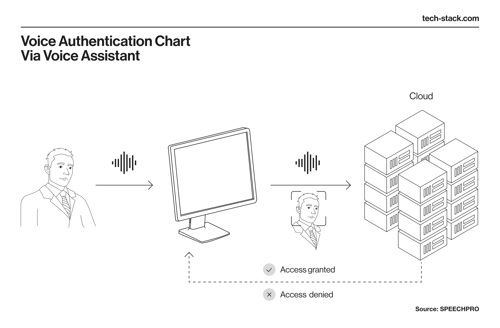
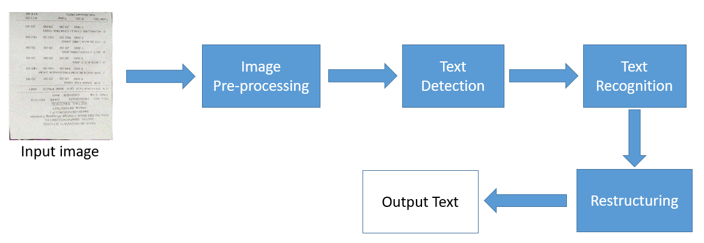

# Civic-AI: Bridging the Gap Between Citizens and Government 🇮🇳



**Civic-AI** is an intelligent, multilingual assistant designed to demystify government schemes, legal notices, and public services for every Indian citizen. By leveraging advanced AI and OCR technology, it breaks down complex bureaucratic language into simple, actionable insights in local languages.

---

## 🚀 Key Features

- **🤖 AI-Powered Simplification**: Instantly translates complex government jargon into simple, easy-to-understand language.
- **📄 Document Analysis (OCR)**: Upload photos of notices or forms to get instant summaries and action items.
  
  

- **🗣️ Multilingual Support**: Interacts in English, Hindi, Marathi, Bengali, Tamil, Telugu, and more.
- **🛡️ Smart Fallback System**: Ensures users get critical information about schemes (like PM Kisan, Ayushman Bharat) even when AI services are offline.
- **🔒 Secure & Private**: Built with enterprise-grade authentication and row-level security.

---

## 🛠️ Tech Stack

### **Frontend (Client)**
- **Framework**: [Next.js 15](https://nextjs.org/) (App Router)
- **Styling**: [Tailwind CSS](https://tailwindcss.com/)
- **State Management**: React Context API
- **HTTP Client**: Axios

### **Backend (Server)**
- **Framework**: [FastAPI](https://fastapi.tiangolo.com/) (Python)
- **AI Engine**: [Google Gemini 1.5 Flash](https://deepmind.google/technologies/gemini/)
- **Database & Auth**: [Supabase](https://supabase.com/) (PostgreSQL + GoTrue)
- **Image Processing**: Pillow (PIL)

---

## 📂 Repository Structure

```
root/
├── client/                 # Frontend Application
│   ├── app/                # Next.js Pages & Routes
│   ├── components/         # Reusable UI Components
│   ├── lib/                # API Clients & Utilities
│   └── contexts/           # Auth & Global State
│
├── server/                 # Backend API Service
│   ├── main.py             # Application Entry Point & Routes
│   ├── fallbacks.py        # Offline Content & Logic
│   └── requirements.txt    # Python Dependencies
│
└── kiro/                   # Project Documentation & Design
    ├── architecture.md     # System Design
    ├── problem.md          # Problem Statement
    └── solution.md         # Solution Overview
```

---

## ⚡ Getting Started

### Prerequisites
- Node.js 18+
- Python 3.10+
- Supabase Account
- Google Gemini API Key

### 1. Clone the Repository
```bash
git clone https://github.com/yourusername/civic-ai.git
cd civic-ai
```

### 2. Backend Setup
```bash
cd server
python -m venv venv
# Windows
.\venv\Scripts\activate
# Mac/Linux
source venv/bin/activate

pip install -r requirements.txt
```

Create a `.env` file in `server/`:
```env
SUPABASE_URL=your_supabase_url
SUPABASE_ANON_KEY=your_supabase_anon_key
SUPABASE_SERVICE_ROLE_KEY=your_service_role_key
GEMINI_API_KEY=your_gemini_key
```

Run the server:
```bash
uvicorn main:app --reload
```

### 3. Frontend Setup
```bash
cd client
npm install
```

Create a `.env.local` file in `client/`:
```env
NEXT_PUBLIC_SUPABASE_URL=your_supabase_url
NEXT_PUBLIC_SUPABASE_ANON_KEY=your_supabase_anon_key
NEXT_PUBLIC_API_URL=http://localhost:8000
```

Run the client:
```bash
npm run dev
```

Visit `http://localhost:3000` to see the app in action.

---

## 🌟 Why Civic-AI?

Government services are often inaccessible due to:
1. **Complex Language**: Legal and bureaucratic terms confuse citizens.
2. **Language Barriers**: Most information is in English, excluding non-English speakers.
3. **Middlemen**: Dependence on agents leads to misinformation and exploitation.

**Civic-AI solves this** by putting a personal government expert in every citizen's pocket.

---

## 📝 License

This project is licensed under the MIT License.
