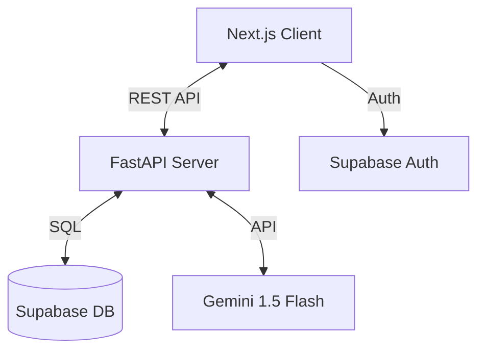

# System Architecture

## 🏗️ High-Level Overview

The application follows a modern **Client-Server** architecture, decoupled to allow independent scaling of the frontend and backend.

## 🧩 Components

### 1. Frontend (Client)
- **Technology:** Next.js 15 (React)
- **Responsibility:**
  - Renders the UI (Dashboard, Chat Interface).
  - Manages Authentication state (via Supabase Auth Helpers).
  - Handles file uploads and sends them to the backend.
- **Key Directories:**
  - `app/`: App Router pages.
  - `components/`: Reusable UI elements (ChatBubble, Sidebar).
  - `lib/`: Axios instance and API wrappers.

### 2. Backend (Server)
- **Technology:** FastAPI (Python)
- **Responsibility:**
  - **API Gateway:** Exposes endpoints for chat (`/chat`), history (`/history`), and uploads.
  - **Orchestrator:** Manages the flow between the database and the AI model.
  - **Fallback Logic:** Checks for AI availability; serves static content from `fallbacks.py` if AI is down.
- **Key Files:**
  - `main.py`: The monolithic entry point containing all route logic (kept simple for hackathon velocity).
  - `fallbacks.py`: Dictionary-based fallback data.

### 3. Database (Supabase)
- **Technology:** PostgreSQL
- **Tables:**
  - `profiles`: User data linked to Auth ID.
  - `chats`: Metadata for chat sessions.
  - `messages`: Individual message history (User/AI).
- **Security:** Row Level Security (RLS) policies ensure users can only access their own data.

### 4. AI Service
- **Provider:** Google Gemini 1.5 Flash
- **Role:**
  - **OCR:** Extracts text from images.
  - **NLU:** Understands user intent and context.
  - **NLG:** Generates simplified, multilingual responses.

## 🔄 Data Flow (Chat)

1. **User** sends a message (text or image) from the Client.
2. **Client** sends a POST request to `/chat` on the Server.
3. **Server** validates the request.
4. **Server** (if image) processes it with PIL.
5. **Server** constructs a prompt and calls **Gemini API**.
6. **Gemini** returns the response.
7. **Server** saves the interaction to **Supabase**.
8. **Server** returns the response to the **Client**.
9. **Client** updates the UI.

